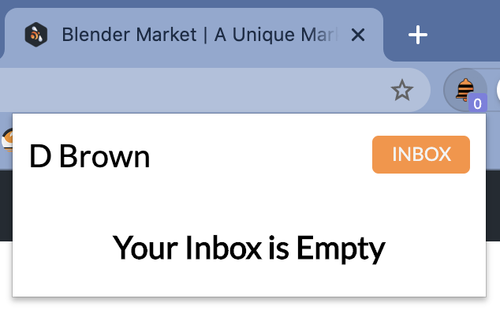
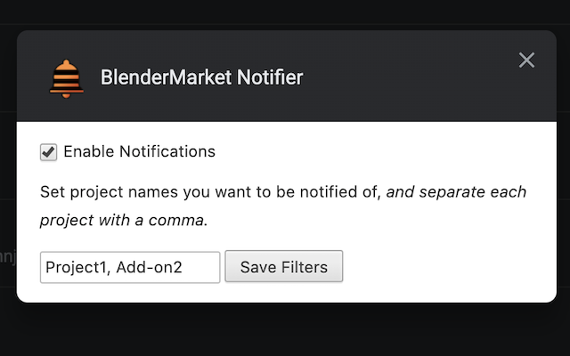

# BlenderMarket Notifier

The Blender Market Notifier is a Chrome Extension to help Market creators and collaborators to have easy access to inbox messages while being notified of updates.

## Installation

### Open the Extensions settings

**Chrome:**

Open the Settings Menu > Tools > Extensions

**Brave:**

Settings Menu > Settings

Choose Extensions from the menu on the left-hand side

Scroll to the bottom, and select the option to Manage Extensions

### Installing the Extension

Flip the Developer Mode switch at the top left of the screen

Click the Load Unpacked option, and choose the cloned folder

## Use

The Extension uses existing login sessions, so all you need to do is go to the Blender Market site, and login to the account you want to monitor. 

The extension icon badge will give you a total count of unread messages (Does not support multiple pages, so the maximum is 25)

You can click the extension icon to get a list of the unread messages, and the details of each one.

## Options

The filters options allows you to limit notifications to prodect names you provide as a comma-separated list of partial project names. For this to work, refrain from using spaces,
and filter with a distinguing portion of the project name. 

Example:

__Project Name__: Super Special Project

To match the project name, any of the following filters will work:

_Super, Spec, Special, Project_

When filtering mutliple projects, you will only need to filter the portion of the name
that is unique.